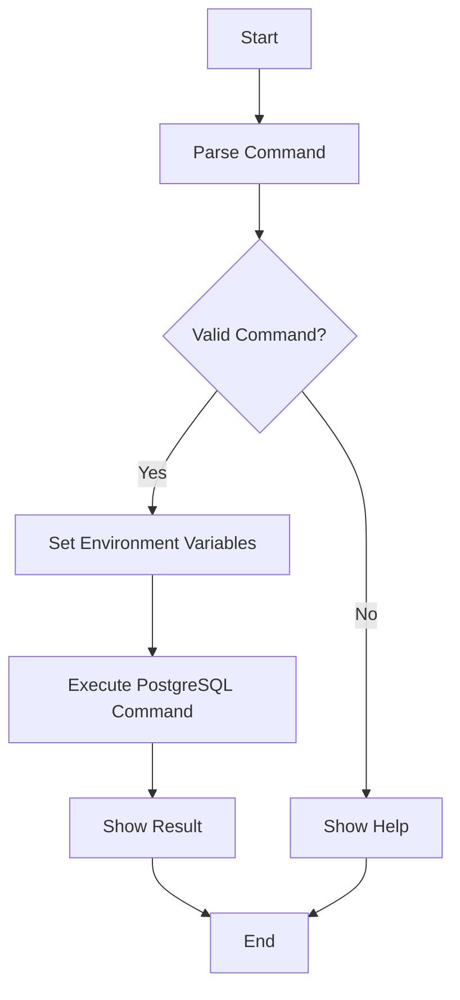

# PostgreSQL CRUD Operations with Bash

> A lightweight example demonstrating PostgreSQL CRUD operations using Bash scripts

[](https://postgresql.org)
[](https://www.gnu.org/software/bash/)
[](LICENSE)

## 🚀 Overview

This Bash script demonstrates complete CRUD (Create, Read, Update, Delete) operations with PostgreSQL using command-line tools. It provides a simple, dependency-free approach to database operations perfect for automation, system administration, and educational purposes.

## ✨ Features

- **Complete CRUD Operations**: Create, Read, Update, Delete, and Drop operations
- **Environment Variables**: Secure database credential management  
- **Error Handling**: Built-in error checking and user feedback
- **Lightweight**: No external dependencies beyond `psql`
- **CLI Interface**: Simple command-line interface with help system
- **Table Management**: Complete table lifecycle management

## 🛠️ Prerequisites

- PostgreSQL 9.0 or higher
- `psql` command-line tool
- Bash 4.0 or higher
- Appropriate database access permissions

## 📦 Installation

1. **Clone the repository**
   ```bash
   git clone <repository-url>
   cd crud-postgresql-bash
   ```

2. **Make script executable**
   ```bash
   chmod +x crud.sh
   ```

## ⚙️ Configuration

Edit the environment variables in `crud.sh`:

```bash
# PostgreSQL Connection Configuration
export PGUSER=your_username
export PGHOST=localhost
export PGDATABASE=your_database
export PGPASSWORD=your_password
export PGPORT=5432
```

### Environment Variables

| Variable | Description | Example |
|----------|-------------|---------|
| `PGUSER` | PostgreSQL username | `postgres` |
| `PGHOST` | Database server hostname | `localhost` |
| `PGDATABASE` | Target database name | `testdb` |
| `PGPASSWORD` | User password | `your_password` |
| `PGPORT` | PostgreSQL port | `5432` |

## 🎯 Usage

### Available Commands

**Create users table:**
```bash
./crud.sh create
```

**Read all users:**
```bash
./crud.sh read
```

**Insert sample user:**
```bash
./crud.sh insert
```

**Update user data:**
```bash
./crud.sh update
```

**Delete specific user:**
```bash
./crud.sh delete
```

**Drop users table:**
```bash
./crud.sh drop
```

### Table Schema

The script creates a `users` table with the following structure:

```sql
CREATE TABLE users (
    email VARCHAR,
    firstName VARCHAR,
    lastName VARCHAR,
    age INT
);
```

### Example Workflow

```bash
# 1. Create the table
./crud.sh create

# 2. Insert sample data
./crud.sh insert

# 3. Read all users
./crud.sh read

# 4. Update user information
./crud.sh update

# 5. Delete specific user
./crud.sh delete

# 6. Clean up (drop table)
./crud.sh drop
```

## 🏗️ Architecture

### Project Structure

```
crud-postgresql-bash/
├── crud.sh          # Main CRUD operations script
├── README.md        # This documentation
└── CHANGELOG.md     # Version history
```

### Script Flow



## 📚 Learning Resources

- **PostgreSQL Documentation**: [PostgreSQL Manual](https://www.postgresql.org/docs/)
- **psql Documentation**: [psql Reference](https://www.postgresql.org/docs/current/app-psql.html)
- **Bash Scripting Guide**: [Advanced Bash-Scripting Guide](https://tldp.org/LDP/abs/html/)

## 📄 License

This project is available under the MIT License. See LICENSE file for details.
